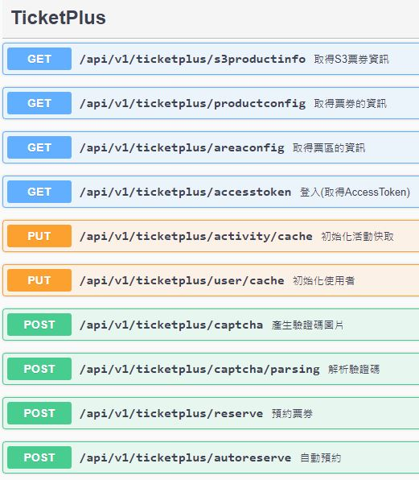

# TicketPlus 遠大售票自動訂票機器人

藉由遠大售票系統探討實作自動化訂票機器人的流程。

https://ticketplus.com.tw/

# 使用說明

純後端開發，無友善的UI呈現，僅提供swagger & redoc 呈現 API 的 schema。

> POST /api/v1/ticketplus/autoreserve 

可以實現自動化訂票流程，相關運行情況請參考log。

> PUT /api/v1/ticketplus/user/cache  
> PUT /api/v1/ticketplus/activity/cache

可事前將場次資訊與使用者資訊儲存(YOASOBI場次有遇到順發流量導致s3資訊與登入api出現異常，但後來基本上沒遇到過)

> GET /api/v1/ticketplus/s3productinfo  
> GET /api/v1/ticketplus/productconfig  
> GET /api/v1/ticketplus/areaconfig  
> GET /api/v1/ticketplus/accesstoken

各種場次，票券，登入相關的API，沒意外不會特別用到

> POST /api/v1/ticketplus/captcha  
> POST /api/v1/ticketplus/captcha/parsing  

取得驗證碼與解析的API

> POST /api/v1/ticketplus/reserve  

實際訂票的API

# 執行方法

將專案 pull 後直接 run 就可以執行，電腦環境需具備.net 7以上的sdk & runtime。

僅測試過windows平台可使用，但理論上linux / docker 環境都能正常運行。

# 技術探討

# 學術研究

本專案僅用於學術研究，請支持手動搶票，等待的過程與忐忑的心也是搶票的醍醐味，困難的道路才有豐收的果實。

# About cpatcha (關於驗證碼)

目前使用自動辨識驗證碼用的元件是:

https://github.com/sml2h3/ddddocr
https://github.com/zixing131/ddddocrsharp